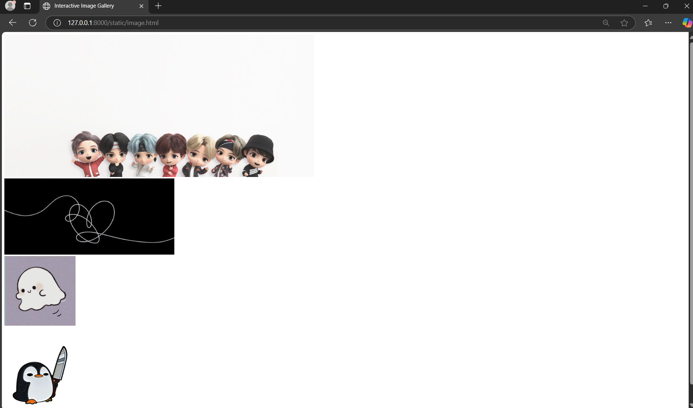

# Ex.08 Design of Interactive Image Gallery
## Date:22/12/2024

## AIM:
To design a web application for an inteactive image gallery with minimum five images.

## DESIGN STEPS:

### Step 1:
Clone the github repository and create Django admin interface.

### Step 2:
Change settings.py file to allow request from all hosts.

### Step 3:
Use CSS for positioning and styling.

### Step 4:
Write JavaScript program for implementing interactivity.

### Step 5:
Validate the HTML and CSS code.

### Step 6:
Publish the website in the given URL.

## PROGRAM :
~~~
<!DOCTYPE html>
<html lang="en">
<head>
<meta charset="UTF-8">
<meta name="viewport" content="width=device-width, initial-scale=1.0">
<title>Interactive Image Gallery</title>

</head>
<body>

<!-- Add more gallery items as needed -->

<!-- The Modal (lightbox) -->

&times;

</body>
</html>
~~~

## OUTPUT:

## RESULT:
The program for designing an interactive image gallery using HTML, CSS and JavaScript is executed successfully.
